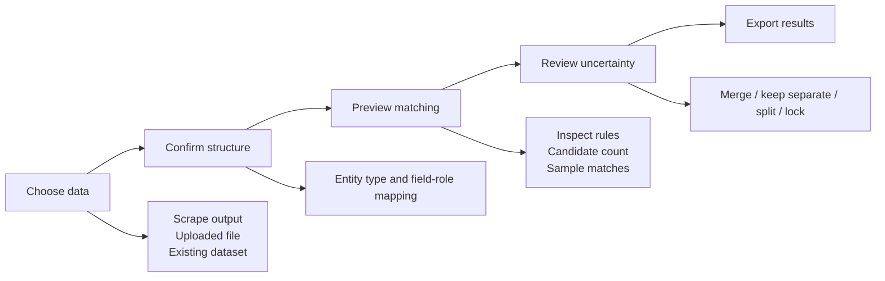

# DataForge: Matching & Deduplication Tab — UI/UX Specification

**Status:** Proposed  
**Companion backend:** `DATAFORGE-MATCHING-DEDUPLICATION-BACKEND.md`  
**Surface:** Dedicated desktop tab, available alongside Scraping, Datasets, Pipelines, and Exports.

## Product Intent

The **Match & Deduplicate** tab turns a raw or scraped dataset into trusted canonical records without hiding the decisions that changed it. Its central promise is:

> Users can see what will be merged, why it is safe, what is uncertain, and how to undo or correct it.

The experience must make the conservative default obvious: uncertain records go to review; they are never silently removed.

## Primary User Flow



| Step | User goal | Backend action | Completion signal |
| --- | --- | --- | --- |
| 1. Choose data | Select a source and a compatible comparison scope. | `POST /datasets/imports` or select existing dataset. | Dataset profile is available. |
| 2. Confirm structure | Confirm entity type and correct proposed field roles. | `POST /datasets/{id}/mapping`. | A versioned mapping is saved. |
| 3. Preview | Understand the expected result before any full run. | `POST /dedupe-jobs` with `run_mode: preview`. | Counts, sample decisions, and warnings appear. |
| 4. Run and review | Resolve uncertain or risky results. | Full job plus review-queue reads/writes. | All review-required items are resolved or explicitly left separate. |
| 5. Export | Export clean, canonical, original, or audit data. | `POST /dedupe-jobs/{id}/export`. | Download/open action is available. |

## Information Architecture

```text
Match & Deduplicate
├── New match job
│   ├── Data source
│   ├── Field mapping
│   ├── Preview settings
│   └── Preview results
├── Active job
│   ├── Progress
│   ├── Match results
│   ├── Review queue
│   └── Export
└── Job history
    ├── Completed jobs
    ├── Saved mappings
    └── Review decisions / constraints
```

The tab always has one primary workspace and a compact persistent job-history rail. Never hide a running job because the user navigated away.

## Layout

### Desktop Default

Use a 12-column application grid. The page header and stepper remain fixed; the active workspace scrolls independently.

```text
+----------------------------------------------------------------------------------+
| Match & Deduplicate                       [Job history] [Help]                    |
| Dataset: Zillow listings — 2,408 rows     Status: Draft                           |
| [1 Data] — [2 Map fields] — [3 Preview] — [4 Review] — [5 Export]                |
|----------------------------------------------------------------------------------|
| Main workspace (8 columns)                        | Job summary (4 columns)       |
|                                                    |                              |
| Contextual screen content                          | Input rows        2,408      |
|                                                    | Candidate pairs   —          |
|                                                    | Auto matches      —          |
|                                                    | Needs review      —          |
|                                                    | Kept separate     —          |
|                                                    |                              |
|                                                    | [Save draft] [Next]          |
+----------------------------------------------------------------------------------+
```

- The `Job summary` rail updates from the current job and remains visible on desktop.
- The next primary action is in the bottom-right position of the rail and page footer; never use more than one primary CTA per state.
- Destructive actions (`Cancel job`, `Discard draft`, `Delete dataset`) use a confirmation dialog that states the affected artifact and whether raw data remains available.

### Responsive Behavior

| Width | Behavior |
| --- | --- |
| Desktop, `>= 1024px` | 8/4 main-and-summary layout; pair comparison uses a two-column source-row view. |
| Compact desktop/tablet, `768–1023px` | Summary becomes a collapsible top panel; comparison remains two columns where possible. |
| Narrow, `< 768px` | Stack all panels; pair comparison becomes a segmented `Record A` / `Record B` view with a persistent decision bar. Review actions remain reachable without horizontal scrolling. |

## Screen Specifications

### 1. Data Source

**Purpose:** Start a job from a recent scrape, an existing dataset, or an imported file.

| Component | Behavior |
| --- | --- |
| Source tabs | `Recent scrape outputs`, `Datasets`, and `Import file`. Default to recent scrape outputs when one is available. |
| Dataset card | Shows dataset name, entity type if known, row count, source/preset provenance, last updated time, and compatible mappings. |
| Comparison scope | `Within this dataset` by default; `Compare with another dataset` is optional and requires matching entity types. |
| Import drop zone | Accepts CSV, XLSX, and JSON. Shows local-only processing notice and does not upload data without explicit user action. |
| Continue | Disabled until a valid source and scope are selected. |

Empty state: “No data is ready to match yet. Import a file or complete a scrape first.” Include `Import file` and `Open Scraping` actions.

### 2. Field Mapping

**Purpose:** Let the user verify how columns become matching evidence before any comparisons occur.

```text
+----------------------------------------------------------------------------------+
| Confirm the fields DataForge will compare                                         |
|----------------------------------------------------------------------------------|
| Source column             Detected role        Canonical field       Confidence   |
| Property Address          Address              address               High         |
| Owner Mailing Address     Address              mailing_address       Needs review |
| Phone Number              Phone                phone                 High         |
| Email                     Email                email                 High         |
| City                      Region               city                  High         |
| Listing URL               URL                  source_url            High         |
|----------------------------------------------------------------------------------|
| [Add field]  [Restore suggestions]                   [Back] [Save mapping & preview] |
+----------------------------------------------------------------------------------+
```

- Render one editable row per input column: source name, preview values, detected role, canonical field, include-as-evidence toggle, and confidence/reason.
- Mark ambiguous mappings with an inline warning and require user confirmation before preview. Example: two address columns must be labeled as `property_address`, `mailing_address`, or excluded—never silently pooled.
- `Other` is the safe default. Role suggestions are assistive, not destructive.
- Surface privacy classifications beside sensitive fields and offer `Exclude from export` without excluding an approved field from matching evidence.
- Save mapping as a named, versioned mapping. Show where an existing mapping is reused and allow a `Save as new mapping` action.

### 3. Preview Settings and Results

**Purpose:** Allow an inexpensive, explainable dry run before a full job.

The settings section uses progressive disclosure. The initial view exposes only entity type, matching strictness, source trust, and preview size. An `Advanced settings` disclosure contains block caps, field weights, model assistance, and export provenance settings.

| Control | Default | Behavior |
| --- | --- | --- |
| Entity type | From mapping | Required; changing it resets incompatible fields with confirmation. |
| Strictness | `Conservative` | Maps to backend thresholds; options are `Conservative`, `Balanced`, and `Custom`. Never label a lower threshold “better.” |
| Source trust | Equal | Lets users rank a verified/internal source above a scraped/secondary source for survivor selection. |
| Model assistance | Off | If available, enables review-queue ranking only; show model version and evaluation status. |
| Preview size | 10,000 rows or configured safe cap | Shows runtime/cost estimate before starting. |

After preview completion, replace the settings body with the results dashboard:

```text
+----------------------------------------------------------------------------------+
| Preview complete: 2,408 rows analyzed                                             |
|----------------------------------------------------------------------------------|
|  1,931 kept separate   |  284 safe matches   |  193 need review                  |
|----------------------------------------------------------------------------------|
| Why some records were not merged                                                   |
| [112] different house number  [43] missing strong evidence  [38] conflicting ID  |
|----------------------------------------------------------------------------------|
| Sample matches                                                                   |
| [High] 123 Main St ↔ 123 Main Street       Exact phone + address       [Inspect] |
| [Review] Acme LLC ↔ ACME, Inc.             Similar name; no phone      [Inspect] |
|----------------------------------------------------------------------------------|
| [Adjust settings] [Start full job]                                                 |
+----------------------------------------------------------------------------------+
```

- Distinguish **safe matches**, **needs review**, and **kept separate** with text and icons—not color alone.
- Provide a `Why?` popover for every count, linking to evidence/guard explanations.
- `Start full job` must state that raw rows will remain unchanged and that only a derived canonical dataset will be created.

### 4. Run Progress

**Purpose:** Keep the user informed without requiring them to understand algorithm internals.

```text
Normalizing fields       Complete       2,408 / 2,408
Finding candidates       Running        38,492 candidate pairs
Evaluating evidence      Queued
Building safe groups     Queued
Creating review queue    Queued
```

- Use stage labels from the backend, not fake percentage progress.
- Show rows processed, candidate pairs, time elapsed, and the current safety limit when meaningful.
- `Pause` finishes the current safe unit of work and prevents new work; `Cancel` stops work and retains raw data. Neither publishes partial canonical output.
- If the user leaves the tab, show progress in the global job center and resume this screen when reopened.

### 5. Review Queue

**Purpose:** Resolve only uncertain pairs/clusters with clear evidence and no hidden side effects.

```text
+----------------------------------------------------------------------------------+
| Review matches                                      193 remaining  [Filters]     |
|----------------------------------------------------------------------------------|
| Record A                                      | Record B                           |
| Source: Zillow scrape, row 145                | Source: Zillow scrape, row 891     |
| 123 Main Street, Austin, TX                   | 123 Main St., Austin, TX           |
| Phone: (512) 555-0182                         | Phone: (512) 555-0182              |
| Price: $420,000                               | Price: $420,000                    |
|----------------------------------------------------------------------------------|
| Evidence                                                                        |
| ✓ Exact phone                Strong evidence                                      |
| ✓ Address similarity 0.99    House number agrees                                  |
| ! Different source timestamp Choose a preferred source if merging                 |
|----------------------------------------------------------------------------------|
| [Keep separate]  [Merge]  [Choose values]  [More actions v]                       |
+----------------------------------------------------------------------------------+
```

| Action | Result |
| --- | --- |
| `Merge` | Creates/updates a cluster after showing the canonical-value preview. |
| `Keep separate` | Adds a scoped `must_not_link` constraint and removes the pair from the queue. |
| `Choose values` | Opens per-field source selection before confirming the merge. |
| `Split cluster` | Available for a cluster with more than two members; requires selecting members to separate. |
| `Lock cluster` | Prevents future automatic changes to this resolved group. |
| `Mark bad mapping` | Returns to the mapping screen and explains which field role likely caused poor candidates. |

- Default focus on `Keep separate`, because it is the safe, reversible option. `Merge` uses the primary style only when no contradiction exists.
- A hard contradiction changes the decision bar to `Cannot auto-merge`; show the conflicting fields and allow only an explicit reviewed override where policy permits it.
- `Merge all similar` is intentionally not provided. Bulk actions are allowed only for reviewer-approved filters with a previewed count and undo window.
- After a decision, advance to the next item and show an undo toast. Keyboard users receive an announced status update.

### 6. Results and Export

**Purpose:** End the job with a comprehensible quality summary and the correct output choice.

| Output | Description |
| --- | --- |
| Canonical dataset | One resolved record per cluster, with selected canonical values. |
| Clean rows | The preferred survivor row per cluster; use when preserving source schema matters. |
| Original rows | Immutable imported/extracted rows; no records removed. |
| Audit report | Match decisions, explanations, source rows, field provenance, and reviewer actions. |

- Display summary cards: input rows, canonical records, rows suppressed in clean export, unresolved review items, and job/mapping/policy versions.
- Disable `Export canonical` if required review is incomplete; allow `Export with unresolved records` only with a clear label and output marker.
- The export dialog has a `Include provenance` toggle enabled by default. If disabled, explain that traceability fields will be omitted.
- Offer `Open in Datasets`, `Use in Pipeline`, and `Start another job` after export.

## Component Handoff

Use existing design-system tokens; token names below are semantic and must map to the application theme rather than fixed color values.

| Component | Required variants / props | Notes |
| --- | --- | --- |
| `DedupeStepper` | `currentStep`, `completedSteps`, `hasBlockingWarning` | Linear for new jobs; completed steps are revisitable. |
| `DatasetSourceCard` | `selected`, `disabled`, `sourceType`, `entityType`, `rowCount`, `provenance` | Entire card selectable; details remain accessible by keyboard. |
| `RoleMappingRow` | `sourceColumn`, `sample`, `role`, `canonicalField`, `confidence`, `sensitive`, `included` | Show confidence reason, not only a percentage. |
| `JobSummaryRail` | `jobStatus`, `counts`, `nextAction`, `collapsed` | Persist while workspace scrolls on desktop. |
| `DecisionMetric` | `kind: safe_match|review|separate|conflict`, `count`, `explanation` | Use icon + label + count; no color-only meaning. |
| `PairComparison` | `left`, `right`, `evidence`, `decisionState`, `clusterSize` | Align comparable fields; highlight exact, similar, missing, and conflicting values distinctly. |
| `EvidenceRow` | `strength`, `field`, `result`, `explanation`, `guard` | `guard` marks a hard contradiction. |
| `CanonicalValuePicker` | `field`, `candidateValues`, `selectedSource`, `trustRank`, `locked` | Requires visible source and timestamp for every choice. |
| `ReviewActionBar` | `canMerge`, `canKeepSeparate`, `canSplit`, `undoAvailable` | Never enables merge when a backend policy guard prohibits it. |
| `JobProgressList` | `stages`, `activeStage`, `cancellable`, `pausable` | Use actual backend state; do not animate fake completion. |

### Tokens

| Token | Usage |
| --- | --- |
| `color-surface`, `color-surface-raised`, `color-border-subtle` | Workspace, cards, and table boundaries. |
| `color-action-primary`, `color-action-danger`, `color-status-success`, `color-status-warning`, `color-status-critical` | Actions and status, always paired with text/icon. |
| `spacing-xs` through `spacing-2xl` | Use consistent density; no local pixel values in feature code. |
| `radius-md`, `shadow-sm` | Cards, drawers, and comparison panels. |
| `font-body`, `font-label`, `font-mono` | Regular content, control labels, and identifiers/scores. |
| `focus-ring-default` | All interactive elements and comparison rows. |

## States, Errors, and Edge Cases

| Situation | UI behavior | Allowed action |
| --- | --- | --- |
| No eligible fields | Explain that at least one identifier/contact/address/URL field is required. | Return to mapping. |
| No candidates | Show success-like neutral result: no duplicates were found under current settings. | Export original/clean data or adjust settings. |
| Huge candidate block | Explain that a common value was capped for safety and may reduce recall. | Inspect mapping, add a stronger field, or adjust an advanced cap with warning. |
| Hard contradiction | Show exact conflicting values and “Cannot auto-merge.” | Keep separate; reviewed override only when policy permits. |
| All fields missing | Explain that the row is retained but cannot be matched automatically. | View source row; fix/import mapping. |
| Mapping changed after preview | Mark preview stale and require a new preview before full run. | Run preview again. |
| Job cancelled/failed | Show completed safe stages, no completed canonical export, and a retry explanation. | Retry from deterministic checkpoint or edit configuration. |
| Review decision conflict | Explain that another local/user decision changed the cluster. | Refresh the item; do not overwrite silently. |
| Long field values | Clamp in comparison cells with `Show full value`; preserve copy access. | Expand/copy. |
| International data | Preserve Unicode and use locale-aware address/phone formatting where mapping supports it. | Change dataset locale in advanced settings. |

## Interaction and Motion

| Trigger | Behavior | Duration / easing |
| --- | --- | --- |
| Step change | Crossfade workspace content; keep header/summary stable. | `motion-fast`, standard easing. |
| Preview starts | Replace CTA with progress state and disable configuration edits. | Immediate. |
| Pair decision | Animate resolved card out, advance next card, then show undo toast. | `motion-standard`, standard easing. |
| Evidence expand | Height transition only if reduced motion is off. | `motion-fast`, standard easing. |
| Error/warning | No shake animation; move focus to summary and announce it. | Immediate. |

Respect `prefers-reduced-motion`: use instant state changes and no card transitions.

## Accessibility

- Use a real tab/page heading hierarchy; the stepper exposes current/completed state through accessible labels.
- Keyboard order: page heading → stepper → workspace controls → summary rail → footer action. Do not trap focus in a comparison panel.
- `PairComparison` exposes aligned fields as a labeled comparison table. Evidence rows announce match strength and reason, not color.
- Provide keyboard shortcuts: `J` next review item, `K` previous item, `M` merge when enabled, `S` keep separate, `U` undo. Display shortcuts in tooltips and allow them to be disabled.
- All toasts use a polite live region; blocking errors and policy conflicts use an assertive announcement and move focus to the explanation.
- Meet WCAG 2.1 AA contrast. Every status has a text label and icon. Never rely on green/red alone for match outcomes.
- Protect sensitive values: redact previews until the user elects to reveal them, do not include them in ARIA labels by default, and provide copy confirmation without reading full values aloud.

## Backend Integration Rules

| UI state | Backend source of truth | UI rule |
| --- | --- | --- |
| Imported / mapping draft | Dataset import and mapping version | UI may edit a draft only; never infer a saved mapping. |
| Preview running/completed | Dedupe job status/events | Counts, stages, and errors are server/worker-provided. |
| Review item | Review queue decision + cluster version | Submit decisions with optimistic version; resolve conflict on mismatch. |
| Merge eligibility | Backend policy + guards | UI can explain but must not enable a prohibited merge. |
| Export availability | Job completion + review status | UI cannot claim an export is final if backend marks it partial/stale. |

The UI must render backend explanations verbatim only after safe formatting; it must never derive a match decision, alter a confidence score, or discard raw/evidence data locally.

## Acceptance Criteria

- A user can complete the complete flow from scraped CSV to preview, review, and provenance-preserving export without leaving the tab.
- The tab clearly differentiates safe automatic matches, review-required candidates, non-matches, and hard conflicts.
- Every merge/review decision exposes its evidence, source provenance, and undo/reversal route.
- Changing mapping or strictness invalidates a previous preview before a full job can begin.
- The tab remains usable at narrow widths, with keyboard only, and with reduced motion enabled.
- The UI never enables an action disallowed by the matching backend’s policy or hard guards.

