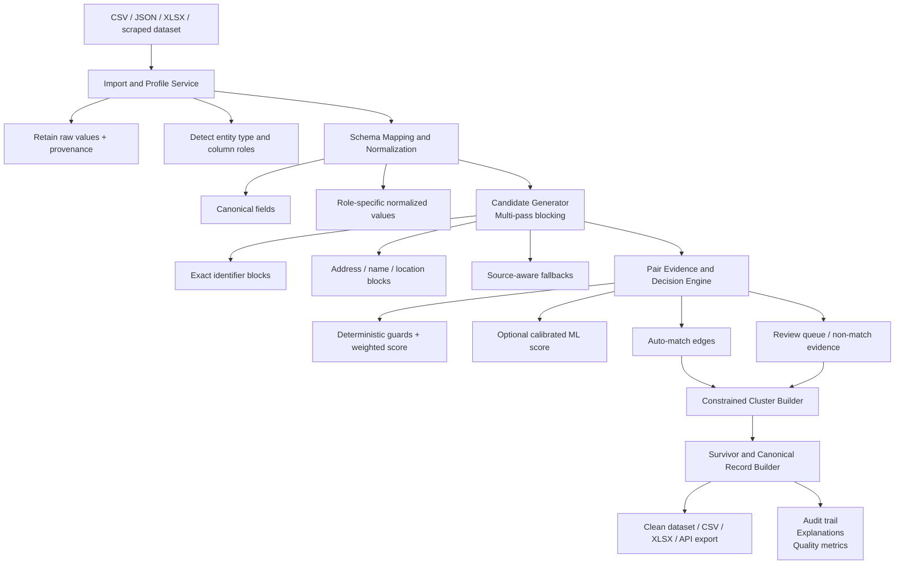

# DataForge: Matching and Deduplication Backend Design

**Status:** Proposed  
**Date:** 2026-09-13  
**Decision:** Build a schema-aware, explainable entity-resolution service with deterministic rules as the default, an optional calibrated ML scorer, conservative cluster controls, and a human-review queue for uncertain matches.

## Outcome

DataForge accepts a scraped CSV, JSON, Excel file, or existing dataset; preserves the imported source rows; identifies duplicate representations of the same real-world entity; groups only high-confidence matches; and produces a survivor record plus an auditable merge history.

The service must favor **not merging** over an incorrect merge. A false positive can erase a distinct property, person, product, job, or business; a missed duplicate remains reviewable and can be resolved later.

## Scope and Guardrails

- Deduplicate only within an explicitly selected entity type: `product`, `property`, `person`, `business`, `job`, `article`, `media`, `software`, or a configured custom type.
- Preserve the raw imported row and source provenance forever until the user deletes the dataset. A merge creates a derived canonical record; it never overwrites the import.
- Never compare unrelated entity types, or automatically merge records from incompatible source schemas, without an explicit mapping.
- Treat phone numbers, emails, street addresses, and other personal data as sensitive. Encrypt data at rest where supported, limit diagnostic logs, and make exports/review access role-aware.
- Do not use an ML model as the sole decision-maker for automatic destructive merges. All automatic merges require deterministic evidence and policy thresholds.

## Architecture



## Backend Stack

| Area | Recommended choice | Why |
| --- | --- | --- |
| Application/service | Python 3.11+ with FastAPI or an internal worker API | Fits the existing DataForge ecosystem and supports worker isolation. |
| Tabular processing | Polars | Fast, memory-efficient column operations for import, normalization, and block generation. |
| Persistent metadata | SQLite for desktop-first; PostgreSQL for shared/server deployment | Stores datasets, mappings, job events, candidates, clusters, review decisions, and audit records. |
| Raw/import artifacts | Local project storage, with content hashes | Keeps original files immutable and traceable without storing duplicate copies. |
| String similarity | RapidFuzz | Fast, deterministic, local fuzzy matching. |
| Address parsing | `libpostal` where available; DataForge fallback normalizer otherwise | Produces structured address parts without treating fuzzy street strings as proof. |
| Phone parsing | `phonenumbers` | Country-aware validation and E.164 normalization. |
| Email validation | Standard parser plus domain-safe normalization | Preserves `@`; do not automatically strip provider-specific local-part variants. |
| Optional ML | scikit-learn gradient boosting/logistic calibration model | Small, explainable feature vector and simple local model lifecycle. |
| Job execution | Existing DataForge worker/job service | Supports cancellation, progress, retries, artifacts, and a desktop/CLI/API front end. |

Use `Polars` and `RapidFuzz` first. Do not introduce a graph database, distributed stream processor, or vector database for the desktop product. Revisit only when job volumes, concurrent users, or a networked deployment justify them.

## Data Contract

### Imported Row

```text
source_row
  id                    immutable UUID
  dataset_id            import/run identifier
  source_file_hash      provenance and repeat-import detection
  source_row_number     original row position
  raw_values            exact imported values
  mapped_values         entity-schema field mapping
  normalized_values     role-specific comparison values
  source_url            optional scraped-page provenance
  extracted_at          optional scrape timestamp
  created_at
```

### Match Decision

```text
match_decision
  id
  left_row_id, right_row_id
  entity_type
  candidate_block_ids
  evidence              per-field values, similarities, guards, and explanations
  deterministic_score
  model_score           optional; never the sole auto-merge condition
  decision              match | possible_match | non_match | rejected
  decision_reason
  policy_version
  created_at
```

### Cluster and Canonical Record

```text
entity_cluster
  id
  dataset_scope
  entity_type
  member_row_ids
  canonical_record_id
  confidence
  status                active | needs_review | split

canonical_record
  id
  cluster_id
  canonical_values
  field_provenance      winning row/value/rule for every output field
  survivor_row_id       retained source row when an original row must be kept
```

The output CSV contains canonical fields plus `cluster_id`, `member_count`, `match_confidence`, `source_row_ids`, and field provenance when enabled. The default export retains the original rows in a separate audit artifact.

## End-to-End Workflow

### 1. Import, Profile, and Map

1. Create an immutable dataset import and hash the source artifact.
2. Profile headers, types, null rates, cardinality, and sample values without exporting sensitive values to logs.
3. Detect candidate entity type and column roles using whole-word header matching first, then strict fuzzy header matching (default ≥92) only when safe.
4. Show the proposed mapping in the UI. Require confirmation for ambiguous roles such as `owner mailing address` versus `property address`.
5. Store the mapping version with the deduplication job. Never silently reuse a mapping from a different source schema.

### 2. Normalize Without Losing the Source

Keep raw and normalized values side by side. Normalization is deterministic, versioned, and unit-tested.

| Role | Normalization | Important rule |
| --- | --- | --- |
| identifier | Trim/case-normalize; validate known formats; preserve leading zeros where meaningful. | An identifier match is strong only inside its provider/namespace. |
| phone | Parse with a selected/default region, store valid E.164 plus digits-only fallback. | Do not infer a country when the evidence is ambiguous. |
| email | Trim and case-fold domain/local part conservatively; reject malformed values. | Preserve `@`; never apply Gmail-style alias removal globally. |
| address | Parse into house number, directional, street, unit, city, region, postal code; canonicalize suffixes. | House number mismatch is a hard contradiction when both exist. |
| name | Unicode normalize, case-fold, strip punctuation, tokenize. | A name alone never automatically merges a person or business. |
| region | Normalize city/state/county/postal formats. | Region refines a candidate; it is not a useful lone block. |
| URL | Canonicalize host/path and remove configured tracking query parameters. | Preserve query parameters that identify an item. |
| other | Case-fold, normalize Unicode/whitespace, preserve original value. | Do not force an unknown column into a semantic role. |

### 3. Generate Candidates by Multiple Blocking Passes

Candidate generation reduces all-pairs comparison while preserving recall. A record enters the union of candidate sets produced by these blocks:

| Entity / evidence | Candidate key examples |
| --- | --- |
| Provider identifier | `provider + normalized_id` |
| Phone | Exact E.164; digits-only fallback only when sufficient length exists. |
| Email | Exact normalized email. |
| Property address | House number + street stem + postal prefix; a second pass may use house number + city + street phonetic key. |
| Product | Provider + SKU/ASIN/GTIN; otherwise brand + normalized model number. |
| Business | Normalized name + phone, or normalized name + street/postal prefix. |
| Person | Exact email/phone; otherwise name token key + postal/region, review-only by default. |
| Job/article/media/software | Provider ID or canonical source URL; title/name + provider only as a low-confidence candidate. |

- Deduplicate candidate pairs across passes and record which blocks produced each pair.
- Cap highly common blocks. Rather than silently skipping all evidence, split them with a stronger secondary key and record that recall may be reduced.
- Use a safe default `max_block_size` of 200. Blocks still above the limit move to a review/diagnostic metric; they never trigger quadratic comparison.
- Do not compare records sharing only a city, county, common surname, category, or generic title.

### 4. Score Evidence and Enforce Contradictions

Compare fields according to their semantics:

- **Interchangeable set fields:** phone and email values can match in any column/order.
- **Positional fields:** property address, mailing address, name, region, and custom mapped fields compare like-for-like. Do not bag all address columns together.
- **Structured fields:** compare parsed address components, product identifiers, dates, and canonical URLs before fuzzy text.

The decision engine produces a weighted evidence score and a human-readable explanation. Default starting weights are phone `0.32`, email `0.28`, address `0.20`, name `0.15`, and region `0.05`, but weights are entity-type and mapping-version specific.

Hard guards apply before a score can become an automatic match:

- An exact matching known provider ID, E.164 phone, or valid email is strong positive evidence, subject to provider/namespace checks.
- Different nonblank house numbers are a hard `non_match` for address-based records unless the entity type explicitly permits a unit/building relationship.
- Different nonblank canonical provider IDs are a hard `non_match`.
- Name/region similarity alone is never enough for auto-match.
- Missing values are **no evidence**, not agreement or disagreement.
- A strong conflict suppresses automatic matching even when a fuzzy aggregate score is high.

### 5. Decide: Auto-Match, Review, or Keep Separate

Start with conservative, entity-specific bands:

| Decision | Required condition | Action |
| --- | --- | --- |
| `match` | A strong deterministic identifier match, or score ≥0.95 with no contradiction and at least one strong evidence type. | Eligible for constrained clustering. |
| `possible_match` | Score 0.75–0.949, incomplete evidence, or model/rule disagreement. | Add to review queue; do not merge. |
| `non_match` | Score below threshold or a hard contradiction. | Keep separate and retain decision evidence. |
| `rejected` | Invalid mapping/data, policy issue, or unsupported entity schema. | Fail the affected row/job with remediation guidance. |

Thresholds are configuration defaults, not universal truth. They are tuned with labeled examples and reviewed separately for each entity type.

### 6. Build Clusters Safely

Use union-find for efficiency, but do **not** union every pair above a threshold blindly. Blind transitive chaining can merge `A` with `C` solely because each resembles `B`.

For each proposed union:

1. Require an `auto_match` edge with its explanation and no `must_not_link` evidence.
2. Check cluster compatibility: no conflicting exact provider ID, email, phone, or house number among existing members.
3. Require sufficient cohesion: each new member has direct strong evidence to a cluster member, not only a transitive path.
4. Send ambiguous bridges to review rather than expanding a cluster.
5. Allow a reviewer to approve, reject, split, or lock a cluster; all actions become durable constraints for future runs.

This preserves the performance of union-find while preventing common chain-merge errors.

### 7. Select the Survivor and Build Canonical Values

Do not always keep the lowest source-row index. Select the survivor with a deterministic policy:

1. Prefer user-locked records.
2. Prefer the configured trusted-source priority.
3. Prefer valid provider IDs, verified contact fields, and richer field completeness.
4. Prefer the most recently verified value only when source trust is equal.
5. Break remaining ties by earliest source row ID for reproducibility.

Build the canonical record field-by-field. For every value, store its source row, source dataset, normalization/merge rule, and timestamp. Conflicting non-empty values are retained in the audit history; fields governed by a policy (for example, verified phone) cannot be overwritten by a lower-trust source.

### 8. Export and Feed the Rest of DataForge

- Export `clean.csv`, `canonical.csv`, or a dataset table with provenance fields enabled by default.
- Emit `dataset.deduplicated` only after the job has completed successfully.
- The pipelines and automation modules consume canonical records by default; users can elect to use original rows or review-pending rows for special workflows.
- Scraped output enters the same import/profile stage. Scrape provenance (`source_url`, preset ID/version, extraction time) survives all matching and exports.

## Optional ML Scorer

The ML scorer improves ranking of uncertain pairs; it does not replace deterministic protections.

- Features are role-based, not source-column-based: exact match, token similarity, parsed-component agreement, presence, edit distance, common-source signals, and conflict flags per role.
- Train from human-reviewed `left_row_id,right_row_id,label` decisions first. Weak labels from deterministic rules may bootstrap development but must be marked as weak and excluded from evaluation claims.
- Use calibrated probabilities and report precision/recall by entity type, source, and score band.
- Require a held-out labeled evaluation set before enabling ML-assisted auto-match. Start by using ML only to sort the review queue.
- Version the model, features, training dataset hash, thresholds, and evaluation metrics with every job decision.

## Review Experience

The review queue shows two source rows, normalized values, field-by-field evidence, differences, score, confidence band, source provenance, and the resulting canonical value preview.

Reviewer actions: `merge`, `keep_separate`, `choose_value`, `split_cluster`, `lock_cluster`, and `mark_bad_mapping`. Every action creates a reusable constraint scoped to the chosen dataset, entity type, or provider schema as appropriate; it must not accidentally apply to unrelated datasets.

## API and Job Contracts

| Operation | Contract |
| --- | --- |
| `POST /datasets/imports` | Creates an immutable import; returns profile and proposed mapping. |
| `POST /datasets/{id}/mapping` | Saves a confirmed entity type and role mapping version. |
| `POST /dedupe-jobs` | Starts a bounded job with dataset, mapping, thresholds, source-trust policy, and run mode (`preview` or `full`). |
| `GET /dedupe-jobs/{id}` | Returns progress by stage, candidate counts, decisions, errors, and artifacts. |
| `GET /dedupe-jobs/{id}/review-queue` | Paginates possible matches with explanations. |
| `POST /review-decisions` | Persists a reviewer decision/constraint with audit metadata. |
| `POST /dedupe-jobs/{id}/export` | Produces original, canonical, clean, and audit exports. |

The desktop UI uses the same job contract through Tauri IPC or the selected local API; it must not embed matching logic in the UI.

## Reliability, Performance, and Observability

### Required Metrics

- Rows imported, mapped, normalized, rejected, and unmatchable.
- Blocks generated, candidate pairs generated/deduplicated/skipped, and maximum block size.
- Match, possible-match, non-match, and contradiction counts by entity type/source/mapping version.
- Cluster size distribution, cluster bridge rejections, survivor source distribution, and review turnaround.
- Stage duration, memory usage, and records/second.
- Precision/recall only when measured against a labeled set; never infer quality from runtime alone.

### Failure Behavior

- A cancelled/failed job leaves the source import untouched and never publishes partial canonical output as complete.
- Persist checkpointed progress only at deterministic stage boundaries; reruns use immutable input/mapping/policy/model versions.
- Invalid CSV fields produce row-level errors where possible; an invalid mapping or policy configuration fails the job before candidate generation.
- Hash artifacts and record software/configuration versions for reproducible reruns.

### Scale Path

The first local implementation targets roughly 100,000 records per job on a typical desktop, using Polars and bounded candidate blocks. Above that scale, shard blocks by deterministic hash and process them in workers, then merge only compatible cluster summaries. Move metadata/artifact coordination to PostgreSQL/object storage only when DataForge becomes multi-user or remote.

## Changes from the Student Draft

The original pipeline is strong: role detection, role-specific normalization, blocking, weighted evidence, and clustering are the right foundation. This design makes it production-safe by:

- retaining immutable raw data and field-level provenance;
- requiring explicit entity schemas and user-confirmed ambiguous mappings;
- using multiple blocking passes instead of one key per role;
- applying hard contradictions and decision bands before clustering;
- preventing unsafe transitive union-find chains;
- selecting a trusted, complete survivor instead of the lowest row index;
- adding review, constraints, metrics, reproducibility, and privacy controls; and
- making ML optional, calibrated, evaluated, and explainable.

## Implementation Phases

### Phase 1 — Deterministic Local Core

- [ ] Define import, mapping, normalized row, match decision, cluster, and audit schemas.
- [ ] Build CSV/JSON/XLSX import, profiling, whole-word role detection, and mapping confirmation.
- [ ] Implement role-specific normalization, multi-pass candidate blocks, hard guards, weighted scoring, and bounded job execution.
- [ ] Generate canonical/clean/audit CSV exports with provenance.

### Phase 2 — Safe Clustering and Review

- [ ] Add constrained union-find, cluster compatibility checks, trusted-source survivor selection, and canonical field policies.
- [ ] Build the review queue and durable merge/keep-separate/split constraints.
- [ ] Add preview mode, cancellation, stage progress, and data deletion controls.

### Phase 3 — Quality Operations

- [ ] Add fixtures, property tests, labeled evaluation datasets, metrics, and regression thresholds.
- [ ] Add source/mapping/policy versioning, replayable job artifacts, and tuning UI.
- [ ] Connect scraped datasets while preserving WebView/preset provenance.

### Phase 4 — Optional ML and Scale

- [ ] Add review-trained, calibrated ML ranking behind feature flags.
- [ ] Enable ML-assisted review ordering; enable auto-match only after entity-specific evaluation gates pass.
- [ ] Add worker sharding and server deployment only when measured workload requires it.

## Acceptance Criteria

- A user can import a scraped CSV, confirm the entity type/mapping, run a preview, and see candidate/match/review counts before committing a full job.
- The service preserves raw input, normalized values, exact mapping/policy/model versions, and field-level provenance for every canonical output.
- No pair is auto-merged on name/region similarity alone, and conflicting provider IDs or house numbers prevent automatic merges.
- Candidate generation has deterministic block caps and does not perform unbounded all-pairs comparisons.
- Clustering rejects ambiguous transitive bridges and supports reviewer-created split/keep-separate constraints.
- Exported canonical records are reproducible from an immutable source artifact and include audit/provenance fields.
- The review queue explains every uncertain pair without exposing secrets in logs or diagnostics.

