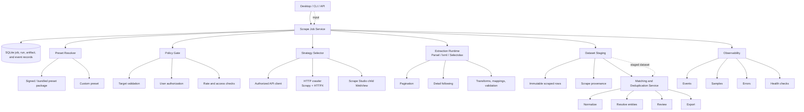
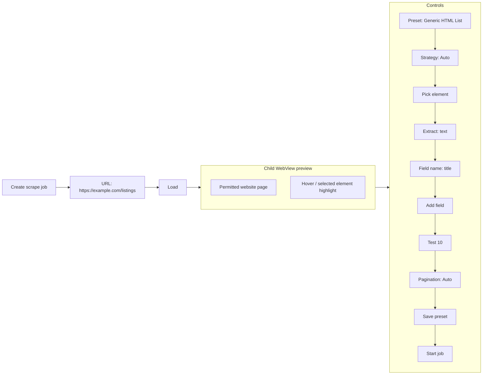

# DataForge: Scraping Engine Upgrade and Website Preset Library

## Summary

Upgrade `dataforge.scraping` from a basic spider registry into a modular, job-based scraping engine. The engine must choose an appropriate permitted collection strategy, run extraction through versioned page-type presets, validate and normalize records, and persist observable job results. All rendered-page work must happen in DataForge's embedded WebView; the application must never open or control a separate browser window.

The product goal is not merely a list of domain-specific scrapers. DataForge must ship an extensible **Website Preset Library** in which every preset represents a specific website *and page type* (for example, Amazon Search Results or Zillow Property Details), with a documented schema, pagination behavior, strategy preferences, validation rules, mappings, and health state.

## Goals

- Support compliant collection from public, permitted HTML pages and documented/authorized APIs.
- Prefer the least expensive viable strategy: authorized API, then HTTP/HTML, then rendering in the embedded WebView.
- Make extraction configuration-driven, inspectable, testable, versioned, and independently deployable.
- Provide reusable preset families for major categories of websites and generic/custom templates.
- Give users a reliable job lifecycle: create, test on a small sample, run, pause/cancel, inspect failures, export, and reuse.
- Produce normalized records that flow directly into DataForge datasets, matching, deduplication, and pipelines.

## Non-Goals

- Bypassing CAPTCHAs, authentication, paywalls, rate limits, robots directives, bot-detection systems, or other access controls.
- Using stolen credentials, residential-proxy evasion, fingerprint spoofing, or traffic designed to conceal automation.
- Treating a site name as authorization to collect its data.
- Promising preset compatibility forever; major sites change frequently.

## Proposed Architecture

### Components

| Component | Responsibility |
| --- | --- |
| `ScrapeJobService` | Creates jobs, tracks state, enforces concurrency/cancellation, and persists outputs. |
| `PresetResolver` | Resolves an immutable preset ID/version, verifies compatibility, and applies allowed overrides. |
| `PolicyGate` | Requires an explicit permitted-use acknowledgement, evaluates preset policy metadata, and blocks disallowed requests. |
| `StrategySelector` | Selects API, HTTP, or embedded-WebView rendering from preset rules and a bounded capability probe. |
| `CrawlerAdapter` | Adapts Scrapy/HTTPX requests and embedded-WebView page sessions to one run contract. |
| `ExtractionRuntime` | Executes selector/API mappings, detail traversal, transforms, and row validation. |
| `HealthService` | Runs fixture/live-permitted checks, computes field coverage, and marks preset versions healthy, degraded, or disabled. |
| `ScrapeStudio` | Hosts a native child WebView inside the DataForge WebView shell, with a control rail, element picker, sample preview, and preset editor. |
| `WebViewBridge` | Provides narrowly scoped navigation, page-ready, DOM-inspection, selector-capture, extraction, pagination, and cancellation commands between the application and child WebView. |

### Recommended Python Toolbox

- **Scrapy** for queues, retries, throttling, request scheduling, and export pipelines.
- **HTTPX** for focused API/HTTP adapters and capability probes.
- **Parsel/lxml** or **Selectolax** for selector-based extraction.
- **Embedded WebView** for permitted pages that require client-side rendering; it is the only rendering surface and remains visibly contained in DataForge.
- **WebView bridge** for controlled navigation, page-ready signals, DOM extraction, and cancellation. It must not launch an external browser or browser-automation process.
- **mitmproxy** only as an internal development diagnostic tool; do not use it to evade access controls.

## Scrape Studio: In-App Page Inspector

Scrape Studio is the visual job builder. It appears as a smaller, native child WebView inside DataForge's main WebView-based desktop UI—visually a window within a window—while a control rail sits next to it. This requires a desktop-shell child-WebView API (for example, a Tauri/WebView2 child view); it must not be implemented as an HTML `iframe`, which cannot safely provide the required cross-origin inspection and navigation control.

### Control Rail

- Show URL, load/reload/stop, selected preset/version, strategy rationale, request/record/page limits, current status, and policy warning state.
- Provide `Pick element`, `Pick repeated item`, `Pick next page`, `Test 10 records`, `Save custom preset`, `Start`, `Pause`, and `Cancel` actions.
- Show selected fields, extraction attribute (`text`, `href`, `src`, or an approved attribute), transform, type, requiredness, preview values, validation warnings, and canonical mapping.
- Keep the preview visible during a WebView run. Navigation, pagination, and extraction events must be reflected in the control rail in real time.

### Click-to-Select Extraction

1. The user loads a permitted URL in the child WebView and selects `Pick element` or `Pick repeated item`.
2. The WebView bridge enters inspection mode: it highlights the element under the pointer and captures the user click without triggering the page's default click action.
3. The bridge returns a bounded DOM descriptor: tag, text sample, safe attributes, DOM path, frame context, and candidate CSS/XPath locators. It must never return password values, form contents, cookies, tokens, or injected page scripts.
4. The user chooses the data source (text, link, image, or approved attribute), names/maps the field, and reviews sample records.
5. For repeated items, DataForge first saves the item container as `record_root`, then saves child-field locators relative to that root. It must not generate brittle page-global locators when a stable relative locator exists.
6. `Pick next page` captures and validates a next-link/button or an approved page/cursor pattern. The user must confirm pagination before a full run.
7. `Test 10 records` validates selector coverage, types, deduplication, and stop conditions. A full run remains blocked until the test succeeds or the user explicitly saves the preset as a draft.

Generated selectors are suggestions, not opaque code. Scrape Studio stores them in the custom preset format, displays the final selector, and allows the user to edit it within the preset schema's URL/policy/strategy limits.

### Selenium Compatibility Boundary

Selenium cannot run *inside* a desktop WebView: it controls a separate WebDriver-managed browser process and cannot reliably attach to, host, or automate the application’s native child WebView. Therefore, a WebView-only release must use `WebViewBridge` rather than Selenium for rendered-page extraction.

If Selenium compatibility is later required for a legacy integration, implement it as a separate, explicitly enabled runner with a clearly documented external browser process. It must not be represented as “running inside” Scrape Studio, and it is out of scope for the WebView-only default. The user-facing page preview and element-picker remain powered by the embedded WebView in all cases.

## Job Model

### States

`draft -> validating -> queued -> running -> completed | failed | cancelled | paused`

The engine must store a state-transition event with time, reason, preset version, selected strategy, and actionable error details. A cancelled job must stop new page requests and retain completed partial output only when the user explicitly elects to keep it.

### Required Job Inputs

| Input | Description |
| --- | --- |
| `preset_id`, `preset_version` | Immutable website/page-type configuration. |
| `start_urls` | User-supplied URLs validated against preset URL patterns. |
| `selected_fields` | Optional subset of the preset schema. |
| `run_mode` | `test` (default maximum 10 records) or `full`. |
| `limits` | Max pages, records, duration, and configured request rate within preset caps. |
| `policy_acknowledgement` | Explicit confirmation that the user is authorized and accepts applicable site terms. |
| `overrides` | Allowed custom mapping/transform changes, saved as a derived custom preset rather than silently changing a built-in preset. |

### Strategy Selection

1. Use an **authorized, documented API** when the preset contains an approved integration and the user supplies required credentials.
2. Otherwise use **HTTP/HTML** if the requested data is present in the initial permitted response.
3. Render in DataForge's **embedded WebView** only when the preset allows it and the content is otherwise unavailable after permitted loading. The navigation stays visible and controllable in the application; no external browser may be opened.
4. Never escalate strategy to solve a block, CAPTCHA, access denial, login wall, rate limit, paywall, or robots restriction. Stop the job and explain why.

The selector records its evidence and chosen strategy. Users may select a lower-cost compatible strategy; they cannot force a disallowed strategy.

### Pagination and Detail Traversal

Presets must declare one of: `none`, `next_link`, `page_parameter`, `cursor`, `infinite_scroll`, `api_cursor`, or `detail_links`.

- Deduplicate canonical page URLs before fetch.
- Stop at a configured maximum, missing next token/link, repeated response signature, or no-new-record threshold.
- Follow detail links only for page types whose schema requires them and only within the preset's allowed host/path scope.
- Infinite scroll requires a stable item-growth and idle condition, and remains subject to record/page/time caps.

## Website Preset Library

Each entry is a page-type preset, not a domain label. The initial catalog should include at least the following coverage; only publish a specific production preset after review, fixture tests, policy metadata, and health checks are in place.

| Category | Website family | Initial page-type presets |
| --- | --- | --- |
| E-commerce | Amazon | Search Results, Product Details, Category, Best Sellers, Deals, Seller Profile, Reviews. |
| E-commerce | eBay, Walmart, Target, Best Buy, Etsy, AliExpress, Newegg | Search Results, Product Details, Category/Collection, Seller/Store where applicable, Reviews where permitted. |
| Real estate | Zillow | Search Results, Property Details, For Sale, For Rent, Sold Properties, Agent Profile, Neighborhood. |
| Real estate | Realtor.com, Redfin, Trulia, Homes.com, Apartments.com, LoopNet, PropertyShark | Search/Listing Results, Property Details, Agent/Broker Profile, Area/Neighborhood, rental/commercial variants where applicable. |
| Jobs | Indeed, LinkedIn Jobs, Glassdoor, ZipRecruiter, Wellfound, Monster | Job Search Results, Job Details, Company Profile, Salary/Market pages where publicly permitted. |
| Local/business | Google Maps, Yelp, Yellow Pages, TripAdvisor, Foursquare | Search Results, Business Details, Category/Location Results, Reviews where permitted. |
| News/community | Reddit, Wikipedia, Medium, major publishers | Search/Index, Article/Thread, Author/Profile, Topic/Category. |
| Media | YouTube, IMDb, Rotten Tomatoes | Search Results, Detail/Watch pages, Creator/Cast Profile, Rankings/Charts, Reviews where permitted. |
| Technology | GitHub, Stack Overflow, Product Hunt, npm | Search Results, Repository/Package/Product Details, Organization/Profile, Issue/Question/Review listings where public and permitted. |
| Generic | Any compatible site | Generic HTML List, Generic HTML Detail, Generic Table, Generic JSON/API, WebView-rendered List, WebView-rendered Detail. |

Preset availability must be **capability- and policy-driven**, not an assertion that every category/page type can be supported on every named service.

## Data and Storage

Persist locally in SQLite initially:

- `scrape_jobs`, `scrape_runs`, `scrape_events`, `scrape_errors`
- `preset_packages`, `preset_versions`, `preset_health_checks`
- `raw_response_metadata` (URL, status, content type, checksum; avoid retaining raw content unless the user elects to)
- `scraped_records`, `record_validation_results`, `exports`

Credentials must use the operating system credential store. Do not store cookies, access tokens, raw HTML, or user data in diagnostic logs by default.

## Downstream Matching and Deduplication

Every completed scrape writes an immutable staged dataset rather than directly overwriting an export. The staged rows retain `source_url`, extraction time, preset ID/version, strategy, and raw extracted values. A user can then start a matching/deduplication preview against that dataset or an explicitly selected compatible dataset. The matching service creates canonical records and an audit export without changing the raw scrape artifact; see `DATAFORGE-MATCHING-DEDUPLICATION-BACKEND.md`.

## Acceptance Criteria

- A user can select a website and then a compatible page type; unsupported URLs are rejected before a run begins.
- A user can run a test scrape capped at 10 records and preview extracted fields, validation warnings, selected strategy, and pagination detection.
- Presets declare field schema, mappings, pagination, strategy constraints, policy metadata, test fixtures, and semantic version.
- The engine follows pagination safely and stops on limits/repetition/no-new-data conditions.
- Output rows include provenance: preset ID/version, source URL, extraction timestamp, and strategy.
- A failed selector or low field coverage marks the preset version degraded and surfaces a user-visible warning.
- Custom changes produce a user-owned derived preset with a parent preset/version reference.
- A user can choose an element, repeated item, detail link, or pagination control in Scrape Studio's child WebView and create a schema-valid draft preset after reviewing selector and sample values.
- The engine blocks prohibited access-evasion behavior and produces a clear user-facing explanation.

## Implementation Phases

### Phase 0 — Contracts and Policy

- Define job, preset, extraction, validation, event, and policy schemas.
- Implement URL allow-list validation, explicit authorization acknowledgement, rate/record/page caps, and stop conditions.
- Add SQLite migrations and structured events.

### Phase 1 — Generic Engine

- Implement generic HTML List, Detail, Table, and JSON/API presets.
- Build HTTP strategy, selector extraction, standard transforms, row validation, CSV/JSON export, and 10-record test mode.
- Add job UI/API lifecycle and a fixture-based test harness.

### Phase 2 — Embedded WebView and Pagination

- Add a bounded embedded-WebView bridge, WebView-safe pagination modes, opt-in screenshots/DOM metadata, and cancellation.
- Provide an in-app rendered-page panel showing current URL, status, page count, and a user-controlled stop action; never launch a separate browser.
- Deliver Scrape Studio’s child-WebView preview, control rail, click-to-select element picker, repeated-item picker, selector preview, and test-run workflow.
- Add unit and integration fixtures for picker-to-preset generation, including repeated cards, links, images, pagination, empty states, and selector regression.
- Implement strategy selection telemetry and a human-readable rationale.

### Phase 3 — Curated Presets

- Deliver approved initial page-type presets starting with Amazon and Zillow, then one representative family per category.
- Add field mappings into DataForge’s canonical product, property, job, business, article, media, and software-record schemas.

### Phase 4 — Preset Operations

- Add package publishing, version rollback, fixture/live-permitted health checks, coverage monitoring, deprecation, and compatibility migration.
- Add a custom-preset editor with preview and validation, plus export/import of user-owned presets.

## Safety, Legal, and Privacy Requirements

- Respect applicable law, site terms, robots directives where applicable, API licenses, copyright/database rights, and contractual restrictions.
- Collect only data the user is authorized to access and needs for the stated purpose; provide field-level opt-outs for personal data.
- No support for defeating CAPTCHAs, logins, paywalls, blocks, rate limits, or anti-bot controls. Treat these signals as a stop condition.
- Default to conservative rate limits and concurrency, configurable only downward unless a reviewed preset authorizes otherwise.
- Clearly identify the user agent where appropriate, provide contact/configuration where required, and avoid disruptive crawling behavior.
- Protect credentials and sensitive outputs; minimize stored raw content and redact query strings/tokens from logs.
- Provide deletion controls for jobs, cached artifacts, and exports, while preserving the minimum audit record required by the user’s configuration.

## Open Decisions

- Confirm the desktop shell's WebView bridge API and whether rendering sessions are isolated per job or per workspace from day one.
- Define the licensing/review process for bundled presets and community-contributed presets.
- Decide which public APIs receive first-class authorized integrations versus generic JSON/API templates.
- Establish ownership and service-level expectations for maintaining high-churn website presets.
