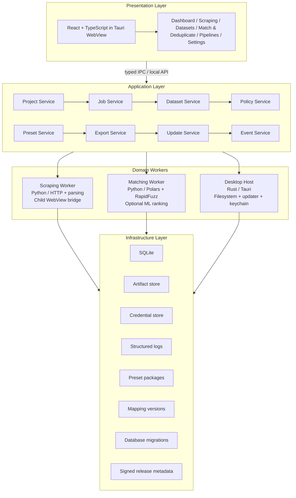

# ADR-001: DataForge Platform Architecture and Release Lifecycle

**Status:** Proposed  
**Date:** 2026-09-13  
**Deciders:** DataForge product and engineering owners  
**Related documents:**

- [DATAFORGE-SCRAPING-ENGINE-UPGRADE.md](Scrapper/Scrapper.md)
- [DATAFORGE-WEBSITE-PRESET-SPEC.md](Scrapper/Website%20Preset%20Specification.md)
- [DATAFORGE-MATCHING-DEDUPLICATION-BACKEND.md](Matching%20and%20Deduplication/Matching%20and%20Deduplication.md)
- [DATAFORGE-MATCHING-DEDUPLICATION-UI-UX.md](Matching%20and%20Deduplication/Matching%20%26%20Deduplication%20Tab.md)

## Context

DataForge is evolving from a Python/Tkinter-oriented data utility into a desktop-first platform that can collect permitted website data, build reusable extraction presets, match and deduplicate records, review uncertain decisions, and export auditable results. It needs to remain useful offline and locally, while being structured so that future server, shared-workspace, and update needs do not force a rewrite.

The main constraints are:

- The desktop application must feel modern without embedding domain logic in the UI.
- Rendered-page collection happens in DataForge’s visible embedded WebView; it must not launch an external browser window.
- Raw imports/scrapes and their provenance must stay recoverable after matching or export.
- Matching must be conservative, explainable, deterministic by default, and able to scale beyond a single CSV.
- Presets, mappings, models, database migrations, and desktop binaries will change over time.
- Future desktop releases must be discoverable through GitHub without trusting unsigned downloads or silently breaking user data.

## Decision

Build DataForge as a **local-first modular desktop application** with a React/TypeScript presentation layer inside Tauri, a small Rust desktop host, and isolated Python workers for the data-heavy domains that benefit from the Python ecosystem.

Use a local API/IPC contract between the UI and application services. Treat scraping, matching, imports, exports, presets, and updates as versioned services with explicit data contracts. Use SQLite as the initial local system of record, with content-addressed artifacts on disk. Use GitHub Releases for release discovery and artifact distribution, but verify a signed release manifest and artifact signature before offering or applying an update.



## Architecture Principles

1. **Local first, cloud optional.** Core jobs, records, presets, and exports work without a hosted account.
2. **Preserve before transforming.** Raw imported/extracted values are immutable; every derived record is traceable.
3. **One contract, multiple entry points.** Desktop UI, CLI, local API, and future remote API use the same application services.
4. **Workers own domain execution.** The UI requests jobs and renders events; it never scrapes, deduplicates, or mutates data itself.
5. **Configuration is versioned code.** Presets, mappings, policies, models, and migrations are semantically versioned and observable.
6. **Conservative automation.** Access controls stop scraping; uncertain matching decisions go to review; updates verify before install.
7. **Progress is real.** Status, percentage, retry, and completion state come from durable job events, not UI guesses.

## Layer and Module Design

### 1. Presentation Layer

**Technology:** React + TypeScript, rendered by the desktop shell WebView.

Responsibilities:

- Navigation, input validation, local state, accessibility, and visualizing job events.
- The Scrape Studio child-WebView panel and its control rail/element picker UI.
- Dataset import/mapping, matching preview/review, export selection, and update prompt surfaces.
- Typed calls to application commands; no direct database, filesystem, worker, or network access.

Key routes/tabs:

| Tab | Primary purpose |
| --- | --- |
| Dashboard | Recent datasets, job health, review count, and available application updates. |
| Scraping | Website presets, Scrape Studio, permitted collection jobs, and staged outputs. |
| Datasets | Imports, profiles, mappings, row samples, provenance, and retention. |
| Match & Deduplicate | Mapping confirmation, preview, review queue, canonical datasets, and audit exports. |
| Pipelines | Explicit automation across staging, matching, exports, and downstream actions. |
| Settings | Projects, data retention, update channel, privacy, credentials, and diagnostics consent. |

### 2. Desktop Host Layer

**Technology:** Tauri/Rust.

Responsibilities:

- Creates the main application WebView and native child WebViews for Scrape Studio.
- Exposes a narrow, typed IPC boundary; validates every command and filesystem path.
- Manages project directories, process lifecycle, OS notifications, safe file dialogs, and credential-store access.
- Hosts the update client and platform-specific update installer/bootstrapper.
- Does **not** contain scraping selectors, matching scores, or business-specific record transformations.

The child WebView is native desktop UI owned by the host, not a regular `iframe`. Its bridge permits only reviewed navigation, page readiness, limited DOM inspection, element selection, extraction, and cancellation. It cannot be used to bypass page restrictions or inject arbitrary scripts.

### 3. Application Layer

Application services orchestrate work and are the only layer that can mutate project state.

| Service | Responsibilities |
| --- | --- |
| `ProjectService` | Creates/opens projects, owns paths, settings, retention, and encryption configuration. |
| `DatasetService` | Registers immutable imports/staged scrapes, profiles fields, versions mappings, and serves samples. |
| `JobService` | Creates, queues, pauses, cancels, resumes, and persists all long-running work/events. |
| `PresetService` | Resolves bundled/custom preset versions, validates policy and URL scope, tracks health/deprecation. |
| `ScrapeService` | Validates collection request, selects permitted strategy, dispatches the scraping worker, stages output. |
| `MatchService` | Validates entity mapping and thresholds, dispatches matching jobs, handles review constraints and canonical records. |
| `ExportService` | Produces canonical, clean, original, and audit artifacts without altering source data. |
| `PolicyService` | Centralizes collection policy, sensitive-data handling, access boundaries, and user acknowledgements. |
| `UpdateService` | Checks verified release metadata, exposes update state, downloads verified packages, and hands off installation. |
| `EventService` | Publishes durable progress/error/audit events to the UI, CLI, and logs. |

### 4. Domain Workers

Workers communicate through typed request/result schemas and durable job state. They may be separate local processes so a crash, heavy CPU load, or dependency update does not take down the UI.

#### Scraping Worker

- HTTP/API collection through approved adapters; parsing through Parsel/lxml or Selectolax.
- Visible rendered-page collection through the child WebView bridge only.
- Versioned preset execution, pagination, validation, rate limits, policy stop conditions, and source provenance.
- Writes immutable staged datasets; never writes directly over canonical output.

#### Matching Worker

- Import mapping, role-aware normalization, multi-pass blocking, pair evidence, constrained clustering, canonicalization, and audit creation.
- Uses Polars for tabular operations and RapidFuzz for deterministic text similarity.
- Provides optional ML ranking only after a model meets evaluation gates; deterministic guards always remain authoritative.
- Returns possible matches to a review queue rather than merging them automatically.

#### Future Workers

- `AutomationWorker`: executes user-approved downstream data-entry recipes.
- `MLWorker`: trains/evaluates matching models and produces versioned artifacts.
- `SyncWorker`: optional future remote backup/collaboration; never required by core local workflows.

### 5. Infrastructure Layer

| Store | Initial implementation | Upgrade path |
| --- | --- | --- |
| Project metadata, jobs, mappings, reviews | SQLite with migrations | PostgreSQL for multi-user/server deployments. |
| Imported/scraped/exported files | Per-project local artifact directory, content hashes | Object storage with encrypted project-scoped access. |
| Credentials | OS credential store | Secret manager for hosted deployment. |
| Logs/events | Structured local files + SQLite job events | Central observability only with explicit telemetry consent. |
| Presets/models | Signed package files and version table | Signed registry/package service. |
| Update manifest/artifacts | GitHub Releases + signed manifest | Dedicated update metadata endpoint/CDN if GitHub capacity or policy requires it. |

## Core Data Flow

```text
1. Scrape or import
   URL/file → policy/profile → immutable staged dataset → dataset metadata

2. Match and deduplicate
   staged dataset + confirmed mapping → normalization → candidates → evidence
   → safe clusters + review queue → canonical dataset + audit artifact

3. Export or pipeline
   canonical/clean/original/audit selection → immutable export artifact
   → user download, local pipeline, or explicitly authorized automation
```

Every job captures:

```text
job_id, project_id, input artifact hashes, preset/mapping/policy/model versions,
software version, started/ended timestamps, state-transition events, result artifacts
```

This makes a user-visible result reproducible and makes support/debugging possible without guessing which configuration created it.

## IPC and API Contract

Start with a versioned local command API. The presentation layer sends commands such as:

```text
project.open
dataset.import
dataset.confirm_mapping
scrape.create_job
scrape.open_studio_session
match.create_preview
match.start_job
match.submit_review_decision
export.create
update.check
update.download
update.install_on_restart
```

Commands return a request ID immediately for long-running operations. Events use a compatible envelope:

```json
{
  "schema_version": 1,
  "event_type": "job.stage_changed",
  "job_id": "...",
  "occurred_at": "...",
  "payload": {}
}
```

Breaking command or event changes require a new schema version and compatibility adapter. The desktop UI and workers must tolerate unknown additive fields.

## Versioning and Compatibility

| Artifact | Versioning rule | Compatibility behavior |
| --- | --- | --- |
| Desktop application | Semantic versioning | Must declare minimum compatible database/preset/mapping schema versions. |
| Database schema | Ordered, idempotent migrations | Backup before migration; block downgrade unless a supported rollback exists. |
| Preset package | Semantic versioning | Jobs pin exact versions; deprecated packages remain readable. |
| Mapping | Immutable mapping version | Mapping change invalidates pending preview/full match runs. |
| Matching policy/model | Versioned with evaluation metadata | Every match decision records the exact version. |
| IPC/event schema | Major version for breaking change | Host/worker/UI negotiate supported versions before job start. |

### Update Paths

- **Patch release:** bug/security fixes, selector fixes, UI adjustments; database/preset migration optional.
- **Minor release:** backward-compatible capability, new preset, new export field, optional feature flag.
- **Major release:** breaking contract or data behavior; provide migration preview, backup, release notes, and explicit confirmation.
- **Preset-only update:** a signed preset package can be installed independently after compatibility and health checks; it cannot alter the application binary.
- **Model-only update:** never auto-enables auto-merge. It enters evaluation/review-ranking mode first.
- **Database migration:** runs after an update is verified but before new app functions use it; failed migrations roll back from backup and keep the prior application runnable when feasible.

## GitHub Release Checking and Secure Updates

### Release Source of Truth

Use a public GitHub repository’s **GitHub Releases** as the discovery and distribution source for desktop builds. Stable-channel checks use the latest non-prerelease release; beta-channel checks use explicitly marked prereleases. Do not bundle a GitHub personal-access token in the desktop app. Private repository updates require a separate authenticated update service or user-managed credentials stored in the OS credential store.

Each release must publish these assets:

```text
DataForge-<version>-<platform>-<architecture>.<installer-or-bundle>
DataForge-<version>-<platform>-<architecture>.<signature>
dataforge-update-manifest-<version>.json
dataforge-update-manifest-<version>.sig
SHA256SUMS.txt
SBOM-<version>.spdx.json
```

The update manifest has an application-controlled schema, for example:

```json
{
  "schema_version": 1,
  "version": "2.4.0",
  "channel": "stable",
  "published_at": "2026-09-13T00:00:00Z",
  "minimum_supported_version": "2.1.0",
  "database_schema": { "minimum": 5, "target": 6 },
  "artifacts": [
    {
      "platform": "windows",
      "architecture": "x86_64",
      "url": "https://github.com/<owner>/<repo>/releases/download/v2.4.0/...",
      "sha256": "...",
      "signature_url": "..."
    }
  ],
  "release_notes_url": "https://github.com/<owner>/<repo>/releases/tag/v2.4.0"
}
```

### Update Client Flow

```text
Application start (after UI is ready) or user clicks Check for updates
    → enforce check interval and channel
    → GitHub Releases API request over HTTPS with ETag / If-None-Match caching
    → select compatible version by SemVer, OS, architecture, and migration rules
    → download manifest and verify detached Ed25519 signature using embedded public key
    → display verified release notes, size, compatibility, and restart requirement
    → user approves download (automatic download is opt-in only)
    → download package, verify SHA-256 and package signature
    → stage package outside active application path
    → install only on user-confirmed restart through the platform updater
    → start new version, run migrations with backup, report success/failure
```

### Update Safety Rules

- GitHub API metadata alone is not trusted enough to install software. Verify the signed manifest and the selected artifact’s hash/signature before installation.
- Embed only the **public** signing key in the desktop client. Keep the private release signing key out of GitHub Actions logs and ordinary repository secrets; use a protected signing workflow/key service where possible.
- Pin allowed update hostnames and require HTTPS. Never follow an update URL to an arbitrary host.
- Check at startup no more than once per 24 hours by default; provide `Check now` and an opt-out in Settings.
- Never auto-install while a job is running, unsaved review decisions exist, or a database backup cannot be created.
- Show version, channel, release notes, download size, restart effect, and migration warning before the user approves installation.
- Keep the prior installer/binary until the new launch and migration report success. Provide `Skip this version` and `Roll back` where platform support permits.
- An emergency security release may show a persistent warning but must still require user consent unless organizational device management governs the installation.

### Release Channels

| Channel | Audience | Behavior |
| --- | --- | --- |
| `stable` | Default users | Only signed, tested non-prerelease GitHub Releases. |
| `beta` | Opt-in testers | Signed prereleases; clear instability warning; uses a separate data directory only when schema compatibility requires it. |
| `nightly` | Internal development only | Not exposed in normal Settings; no production data recommendation. |

## GitHub Release Pipeline

```text
Pull request
  → format, lint, unit tests, contract tests, migration tests, security scan
  → preview builds (no signing/release)

Protected release tag vX.Y.Z
  → reproducible platform builds
  → integration/UI smoke tests + update/rollback test
  → generate SBOM + checksums
  → sign manifest and artifacts in protected signing environment
  → create GitHub Release and upload assets
  → publish release notes + compatibility matrix
  → post-release smoke check using clean install and prior-version upgrade
```

### Required Release Gates

- [ ] All unit, integration, end-to-end, and contract tests pass for the tagged commit.
- [ ] Database migrations tested from every supported previous schema and on a copy of representative project data.
- [ ] Preset/mapping/model compatibility matrix reviewed; disabled/degraded presets are not silently re-enabled.
- [ ] Platform bundles are code-signed where the platform supports it, and update assets pass hash/signature verification in a clean test environment.
- [ ] SBOM, checksums, signed manifest, release notes, and rollback instructions are published with the release.
- [ ] A clean install, update from prior stable version, no-update case, failed-download case, and failed-migration recovery are tested.

## Options Considered

### Option A — Tauri + React/TypeScript + Rust Host + Python Workers (Chosen)

| Dimension | Assessment |
| --- | --- |
| Complexity | Medium: multi-language boundaries require contracts. |
| Cost | Low: local open-source stack and no required hosted services. |
| Scalability | High: workers and services can later move behind a remote API. |
| Team familiarity | Good for teams with existing Python data logic and web UI skills. |

**Pros:** Modern desktop UX, small app shell, native WebView support, preserves Python scraping/data ecosystem, clear isolation of heavy work.

**Cons:** IPC/versioning and packaging are more involved than a single-language app.

### Option B — PySide6 + Python Monolith

| Dimension | Assessment |
| --- | --- |
| Complexity | Low initially. |
| Cost | Low. |
| Scalability | Medium: UI and worker boundaries can blur over time. |
| Team familiarity | Highest for a Python-only team. |

**Pros:** Fastest route from the existing code; single toolchain.

**Cons:** More difficult to deliver the requested WebView-heavy UI and evolve into independently managed services without later restructuring.

### Option C — Electron + React/TypeScript + Python Workers

| Dimension | Assessment |
| --- | --- |
| Complexity | Medium. |
| Cost | Low to medium due to larger desktop bundles. |
| Scalability | High. |
| Team familiarity | High for web-focused teams. |

**Pros:** Mature desktop/web ecosystem and straightforward browser-like UI development.

**Cons:** Larger runtime footprint, especially alongside data workers and embedded page rendering.

## Consequences and Future Revisit Points

This decision makes DataForge easier to extend with new presets, data sources, matching strategies, and UI tabs without making the desktop UI responsible for domain logic. It also makes outputs reproducible and update behavior safer.

It introduces versioned contracts, local process management, signing infrastructure, and test/release discipline. Revisit the following when evidence demands it:

- Move SQLite/artifacts to PostgreSQL/object storage only for collaborative or hosted workloads.
- Introduce a hosted preset/update metadata service only if GitHub Releases limits, private distribution, regional delivery, or organization policy require it.
- Split workers into remote services only after local worker throughput or reliability becomes a measured constraint.
- Evaluate whether the WebView bridge needs additional platform adapters after Windows support is stable; do not claim cross-platform parity before testing macOS/Linux behavior.

## Implementation Roadmap

### Foundation

- [ ] Create the workspace structure: `apps/desktop`, `crates/desktop-host`, `services/application`, `workers/scraping`, `workers/matching`, `packages/contracts`, and `packages/presets`.
- [ ] Define versioned IPC/event schemas, project directory conventions, SQLite migrations, job state machine, and structured logs.
- [ ] Implement project open/create, dataset staging, job center, error boundaries, and credential-store abstraction.

### Scraping and Presets

- [ ] Implement the Scrape Studio child WebView/bridge, policy gate, generic presets, staged outputs, and health checks.
- [ ] Add signed preset package loading and exact version pinning.

### Matching and Review

- [ ] Implement mapping, deterministic matching worker, constrained clusters, canonical/audit exports, and review UI.
- [ ] Add optional ML ranking only after labeled evaluation and feature/version tracking are in place.

### Update System and Release Operations

- [ ] Implement update-channel settings, GitHub discovery with ETag caching, signed-manifest/artifact verification, staging, and restart install.
- [ ] Establish protected signing, release workflow, migration backup/recovery, SBOM generation, and rollback tests.
- [ ] Release a closed beta before making stable automatic checks the default.

## Acceptance Criteria

- The UI can start and observe scraping/matching/export jobs without containing their domain logic.
- Raw sources, staged data, canonical records, reviews, and exports are versioned and traceable.
- A preset/mapping/model/database update cannot silently change a previously completed job’s result.
- The desktop client checks GitHub Releases within the configured interval, displays only compatible verified releases, and refuses unsigned/tampered artifacts.
- Updating does not interrupt active jobs or overwrite user data without a verified backup and explicit user confirmation.
- A failed update or migration leaves the previous project data recoverable and provides a clear recovery path.

